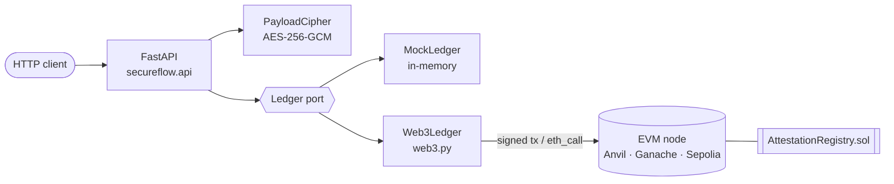

# SecureFlow

A FastAPI service that issues, verifies and revokes **attestations** on an Ethereum smart contract.
An attestation is a signed, timestamped statement from an issuer about a recipient address, such as
*"completed Advanced Python, grade A"*. Once written, anyone can check it on-chain without trusting SecureFlow.

- **Own Solidity contract** (`AttestationRegistry`): collision-free uids, issuer-only revocation, custom errors.
- **Adapter-based ledger.** A `mock` backend runs with no chain and no credentials. A `web3` backend runs against any
  EVM node. Both pass the same API test suite.
- **Optional payload encryption.** AES-256-GCM seals the payload bound to the recipient, so only ciphertext goes
  on-chain.
- **Tested against a real EVM.** pytest deploys the compiled contract into an in-process EVM (py-evm), so there's no
  node to run.

## Quick start

**Mock mode (no chain, no keys):**

```bash
pip install -e ".[dev]"
python -m secureflow.demo          # full lifecycle, in-process
uvicorn secureflow.api:app         # or serve it: http://localhost:8000/docs
```

**Full stack (local chain + deployed contract + API):**

```bash
docker compose up --build
python -m secureflow.demo --url http://localhost:8000
```

Compose starts [Anvil](https://book.getfoundry.sh/anvil/), deploys the contract with a one-shot `deploy` service, then
starts the API in `web3` mode.

**Tests:**

```bash
pytest          # 60 tests; API tests run once per backend
```

## Architecture



| Module | Responsibility |
|---|---|
| `secureflow/api.py` | Routes, request validation, error-to-HTTP mapping. Builds the app lazily, so importing it needs no env or node. |
| `secureflow/ledger/base.py` | The `Ledger` protocol, domain types and errors, and `compute_uid`, which mirrors the contract's uid derivation. |
| `secureflow/ledger/mock.py` | In-memory ledger that behaves like the contract, down to identical uids. |
| `secureflow/ledger/web3_ledger.py` | Lazy connection, local signing, gas estimation, EIP-1559 fees, and custom-error decoding. |
| `secureflow/crypto.py` | Payload encryption with an env-supplied key. |
| `secureflow/deploy.py` | Deploys the contract and writes `deployments/local.json`. |
| `contracts/AttestationRegistry.sol` | The contract. Its compiled ABI and bytecode are committed as `secureflow/AttestationRegistry.json`. |

## API

| Method | Path | Description |
|---|---|---|
| `GET` | `/health` | Backend, chain id, issuer address, latest block, whether encryption is on |
| `POST` | `/attestations` | Issue: `{"recipient": "0x…", "data": "…", "encrypt": false}` → `201 {uid, tx_hash, block_number}` |
| `GET` | `/attestations/{uid}` | Verify: returns the record plus `valid` (exists and not revoked) |
| `GET` | `/attestations` | List newest first; filter with `?issuer=`, `?recipient=`, `?limit=` |
| `POST` | `/attestations/{uid}/revoke` | Revoke (issuer only) |

Errors: `404` unknown uid · `409` already revoked · `403` not the issuer · `422` bad address, uid or payload ·
`503` node unreachable or contract missing.

Interactive docs are at `/docs` when the server is running.

## Configuration

All settings come from environment variables (or `.env`; see [`.env.example`](.env.example)).

| Variable | Default | |
|---|---|---|
| `SECUREFLOW_BACKEND` | `mock` | `mock` or `web3` |
| `ETH_RPC_URL` | `http://127.0.0.1:8545` | JSON-RPC endpoint (`INFURA_URL` also accepted) |
| `ETH_PRIVATE_KEY` | — | Signing key for `web3`. Use a throwaway dev/testnet key. |
| `CONTRACT_ADDRESS` | — | Overrides the deployment file |
| `SECUREFLOW_DEPLOYMENT_FILE` | `deployments/local.json` | Written by `python -m secureflow.deploy` |
| `SECUREFLOW_ENCRYPTION_KEY` | — | Base64 32-byte key; generate with `python -m secureflow.crypto` |

### Against your own node

```bash
export SECUREFLOW_BACKEND=web3 ETH_RPC_URL=http://127.0.0.1:8545 ETH_PRIVATE_KEY=0x…
python -m secureflow.deploy         # writes deployments/local.json
uvicorn secureflow.api:app
```

### Changing the contract

```bash
pip install -e ".[compile]"
python scripts/compile_contract.py  # regenerates secureflow/AttestationRegistry.json
```

The contract compiles for the `paris` EVM target, which avoids `PUSH0`, so the same bytecode runs on Ganache, Anvil,
Hardhat, py-evm and public testnets.

## Design notes

- **Collision-free uids.** `uid = keccak256(abi.encode(issuer, recipient, data, block.number, attestationCount))`.
  The counter means two identical attestations in the same block still get distinct uids. `abi.encode` is used instead
  of `encodePacked` to avoid ambiguous concatenation of dynamic types.
- **Mock parity is tested, not assumed.** `test_uid_matches_contract_derivation` checks that the Python `compute_uid`
  produces exactly the uid the deployed contract emits.
- **Custom errors, not revert strings.** They're cheaper to deploy and to revert, and `Web3Ledger` maps their selectors
  to domain exceptions (`AttestationNotFound`, `NotIssuer`, …), which the API turns into status codes.
- **Encryption is opt-in and honest about its limits.** Chain data is public, so sensitive payloads are sealed before
  submission. The key must come from the environment. A generated-per-process key would make old ciphertext
  unreadable after a restart. The recipient address is bound as associated data, so a ciphertext copied into
  another recipient's attestation fails authentication. The service holds the key, so it can read everything it has
  encrypted. This is confidentiality from the public, not end-to-end encryption.
- **No import-time side effects.** Connecting to the node happens on first use, so tests, CI and tooling can import
  every module without a chain.
- **Nonce safety.** Transactions go out under a lock with `pending` nonces, so concurrent requests from FastAPI's
  thread pool don't collide.

## Limitations

- `GET /attestations` rebuilds the list from `AttestationCreated` logs and reads each record. That's fine on a local
  or private chain. On a busy public chain you'd page the block range or read from an indexer (e.g. The Graph).
- One signing key per service instance, and the service is the only issuer it can act as.
- The mock ledger is in-memory and resets on restart.

## License

MIT
