# SecureFlow

A FastAPI service that issues, verifies and revokes **attestations** on an Ethereum smart contract.
An attestation is a signed, timestamped statement from an issuer about a recipient address, such as
*"completed Advanced Python, grade A"*. Once written, anyone can check it on-chain without trusting SecureFlow.

- **Own Solidity contract** (`AttestationRegistry`): collision-free uids, optional expiry, issuer-only revocation,
  custom errors.
- **Adapter-based ledger.** A `mock` backend runs with no chain and no credentials. A `web3` backend runs against any
  EVM node. Both pass the same API test suite.
- **Production concerns covered:** API-key auth on writes, idempotency keys so retries never issue twice, a SQLite
  event indexer with cursor pagination, JSON logs with request IDs, and Prometheus metrics.
- **Optional payload encryption.** AES-256-GCM seals the payload bound to the recipient, so only ciphertext goes
  on-chain.
- **Tested against a real EVM.** pytest deploys the compiled contract into an in-process EVM (py-evm), including
  time travel to test expiry. 133 tests, 94% branch coverage, and mypy `--strict`.

## Quick start

**Mock mode (no chain, no keys):**

```bash
pip install -e ".[dev]"
python -m secureflow.demo          # full lifecycle, in-process
uvicorn secureflow.api:app         # or serve it: http://localhost:8000/docs
```

**Full stack (local chain + deployed contract + API):**

```bash
docker compose up --build
python -m secureflow.demo --url http://localhost:8000 --api-key sf_demo_do_not_use_in_production
```

Compose starts [Anvil](https://book.getfoundry.sh/anvil/), deploys the contract with a one-shot `deploy` service, then
starts the API in `web3` mode with a persistent index.

**Checks:**

```bash
pytest          # tests + coverage gate (90%)
mypy            # strict
ruff check . && ruff format --check .
```

## Architecture

```mermaid
flowchart LR
    client([HTTP client]) -->|X-API-Key, Idempotency-Key| api[FastAPI<br/>secureflow.api]
    api --> crypto[PayloadCipher<br/>AES-256-GCM]
    api -->|writes + verify| port{{Ledger port}}
    api -->|lists| index[AttestationIndex]
    index -->|events&#40;from, to&#41;| port
    index --- db[(SQLite<br/>index + idempotency)]
    port --> mock[MockLedger<br/>in-memory]
    port --> w3[Web3Ledger<br/>web3.py]
    w3 -- signed tx / eth_call / eth_getLogs --> node[(EVM node<br/>Anvil · Sepolia · …)]
    node --- contract[[AttestationRegistry.sol]]
```



Writes and single-attestation verification always go to the ledger, which is the source of truth. Lists are
served from an index that follows the contract's events.

| Module | Responsibility |
|---|---|
| `secureflow/api.py` | Routes, validation, auth and idempotency wiring, and error-to-HTTP mapping. Builds the app lazily, so importing it needs no env or node. |
| `secureflow/ledger/base.py` | The `Ledger` protocol, domain types and errors, and `compute_uid`, which mirrors the contract's uid derivation. |
| `secureflow/ledger/mock.py` | In-memory ledger that behaves like the contract, down to identical uids and an event stream. |
| `secureflow/ledger/web3_ledger.py` | Lazy connection, local signing, gas estimation, EIP-1559 fees, custom-error decoding and event reads. |
| `secureflow/index.py` | Chunked event sync into SQLite, reorg-safety depth, and keyset pagination. |
| `secureflow/idempotency.py` | Claim, replay or reject semantics for `Idempotency-Key`. |
| `secureflow/auth.py` | Hashed API keys, constant-time comparison, and a key generator CLI. |
| `secureflow/observability.py` | JSON logging, request-ID propagation and Prometheus metrics. |
| `secureflow/crypto.py` | Payload encryption with an env-supplied key. |
| `contracts/AttestationRegistry.sol` | The contract. Its compiled ABI and bytecode are committed as `secureflow/AttestationRegistry.json`. |

## API

| Method | Path | Auth | Description |
|---|---|---|---|
| `GET` | `/health` | – | Backend, chain id, issuer, latest block, index position, and whether auth/encryption are on |
| `GET` | `/metrics` | – | Prometheus exposition format |
| `POST` | `/attestations` | key | Issue: `{"recipient", "data", "encrypt"?, "expires_at"?}` → `201 {uid, tx_hash, block_number}` |
| `GET` | `/attestations/{uid}` | – | Verify against the contract: the record plus `revoked`, `expired` and `valid` |
| `GET` | `/attestations` | – | `{items, next_cursor}`, newest first. Filters: `issuer`, `recipient`, `status=all\|valid\|revoked\|expired`, `limit`, `cursor` |
| `POST` | `/attestations/{uid}/revoke` | key | Revoke. Only the API client that issued it (and only this service's issuer). |

**Auth.** Send `X-API-Key: sf_…` on writes. Reads are public, because verification should be open to anyone.

**Idempotency.** Send `Idempotency-Key: <unique id>` on `POST /attestations`:

| Situation | Response |
|---|---|
| First request | Runs normally; the response is stored for 24 h |
| Retry, same body | Stored response replayed, with `Idempotent-Replayed: true`. No second transaction. |
| Same key, different body | `422` |
| Same key, first request still in flight | `409` with `Retry-After: 1` |
| First request failed before anything was broadcast | Key released, so the retry runs |
| First request **timed out after broadcast** (`503`) | Retry looks the recorded tx hash up on-chain. If it's mined, you get the result (`201`, replayed). If it's still in the mempool, `409`. If the node has never seen it and 10 min have passed, it's sent again. |

Keys are scoped per API client.

**Errors:** `401` missing or invalid key · `403` not the issuer · `404` unknown uid · `409` already revoked ·
`422` invalid input · `503` node unreachable or contract missing.

Every response carries `X-Request-ID`. Send your own to correlate with your logs.

Interactive docs are at `/docs` when the server is running.

## Configuration

All settings come from environment variables (or `.env`; see [`.env.example`](.env.example)).

| Variable | Default | |
|---|---|---|
| `SECUREFLOW_BACKEND` | `mock` | `mock` or `web3` |
| `ETH_RPC_URL` | `http://127.0.0.1:8545` | JSON-RPC endpoint (`INFURA_URL` also accepted) |
| `ETH_PRIVATE_KEY` | — | Signing key for `web3`. Use a throwaway dev/testnet key. |
| `CONTRACT_ADDRESS` | — | Overrides the deployment file |
| `SECUREFLOW_DEPLOYMENT_FILE` | `deployments/local.json` | Written by `python -m secureflow.deploy` |
| `SECUREFLOW_API_KEYS` | — | `name:sha256hex,…`. **Required for `web3`.** Generate with `python -m secureflow.auth <name>` |
| `SECUREFLOW_DB` | `:memory:` | SQLite file for the index and idempotency records |
| `SECUREFLOW_INDEX_CONFIRMATIONS` | `0` | Blocks to wait before indexing (reorg safety; ~12 on public chains) |
| `SECUREFLOW_INDEX_CHUNK` | `2000` | Max blocks per `eth_getLogs` call |
| `SECUREFLOW_ENCRYPTION_KEY` | — | Base64 32-byte key; generate with `python -m secureflow.crypto` |
| `SECUREFLOW_LOG_LEVEL` / `SECUREFLOW_LOG_FORMAT` | `INFO` / `json` | `text` for human-readable logs |

### Against your own node

```bash
python -m secureflow.auth my-client      # prints a key for the client and the env entry for the server
export SECUREFLOW_BACKEND=web3 ETH_RPC_URL=http://127.0.0.1:8545 ETH_PRIVATE_KEY=0x… \
       SECUREFLOW_API_KEYS=my-client:… SECUREFLOW_DB=secureflow.db
python -m secureflow.deploy              # writes deployments/local.json
uvicorn secureflow.api:app
```

### Changing the contract

```bash
pip install -e ".[compile]"
python scripts/compile_contract.py       # regenerates secureflow/AttestationRegistry.json
```

The contract compiles for the `paris` EVM target, which avoids `PUSH0`, so the same bytecode runs on Ganache, Anvil,
Hardhat, py-evm and public testnets.

## Design notes

- **Collision-free uids.** `uid = keccak256(abi.encode(issuer, recipient, data, block.number, attestationCount))`.
  The counter means two identical attestations in the same block still get distinct uids. `abi.encode` is used instead
  of `encodePacked` to avoid ambiguous concatenation of dynamic types.
- **Mock parity is tested, not assumed.** `test_uid_matches_contract_derivation` checks that the Python `compute_uid`
  produces exactly the uid the deployed contract emits.
- **Expiry is enforced on-chain.** `isValid(uid)` checks revocation and `block.timestamp`, and the contract rejects
  an expiry in the past. The API's `valid` field mirrors that logic. A test time-travels the in-process EVM to prove
  the contract's view flips.
- **Why an index.** Listing straight from `eth_getLogs` costs one full log scan plus an `eth_call` per row on every
  request, and hosted RPC providers cap the block range per call. The index syncs forward in bounded chunks,
  remembers its position, and answers lists with an indexed SQL query and **keyset pagination** on
  `(block_number, log_index)`. That stays stable while new attestations arrive, unlike `OFFSET`. Local state is bound
  to the chain id, contract address and deployment block hash, so a restarted dev chain wipes it instead of serving
  ghosts. On public chains, set `SECUREFLOW_INDEX_CONFIRMATIONS` (e.g. 12) to keep reorgs out. The default of 0 suits
  local chains, which don't reorg.
- **Why idempotency keys, and why record the tx hash first.** Issuing is a paid, irreversible transaction. A client
  that times out can't tell whether the attestation was written, and nor can the server if the timeout came after
  broadcast. So the signed transaction's hash is stored against the key *before* it is sent. A retry resolves that
  hash on-chain instead of sending a second transaction, even if the first process crashed mid-request. Only
  failures that certainly sent nothing (a revert during gas estimation, the node refusing the transaction) release
  the key. `test_timeout_after_broadcast_then_retry_does_not_issue_twice` covers the scenario end to end.
- **Per-client revocation.** Every client signs with the service's one key, so the contract's `NotIssuer` check can't
  tell clients apart. The service records which API client issued each uid and refuses revocation by anyone else.
- **Auth that fails closed.** Only SHA-256 hashes of API keys are configured. Every stored hash is compared in
  constant time, with no early exit. The `web3` backend refuses to start unless at least one well-formed key
  *parses*, so a blank or garbled setting can't silently switch auth off.
- **Custom errors, not revert strings.** They're cheaper to deploy and to revert, and `Web3Ledger` maps their selectors
  to domain exceptions, which the API turns into status codes.
- **Encryption is opt-in and honest about its limits.** Chain data is public, so sensitive payloads are sealed before
  submission. The key comes from the environment, and the recipient address is bound in as associated data. The
  service holds the key, so this is confidentiality from the public, not end-to-end encryption.
- **Observability without cardinality blow-ups.** Metrics are labelled by route *template* (`/attestations/{uid}`),
  not raw path. Incoming `X-Request-ID` values are validated before being echoed into logs.
- **No import-time side effects.** Connecting to the node happens on first use, so tests, CI and tooling can import
  every module without a chain.

## Limitations

- One signing key per service instance, so the service can only act as that one issuer.
- SQLite with a process-level lock suits a single API instance. Running several replicas would mean moving the index
  and idempotency store to Postgres (the `Database` class is the only thing to swap).
- The index follows reorgs only up to the confirmation depth. It doesn't roll back deeper reorganisations.
- A transaction stuck in the mempool longer than the 10-minute stale window, then dropped and re-sent, could in
  theory land twice. Closing that needs same-nonce replacement, which isn't implemented.
- Attestations issued outside this service, or before its database was reset, have no recorded owner, so any API
  client can revoke them.
- The mock ledger is in-memory and resets on restart.

## License

MIT
